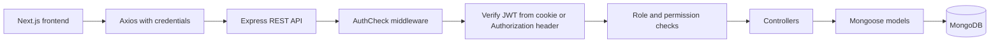
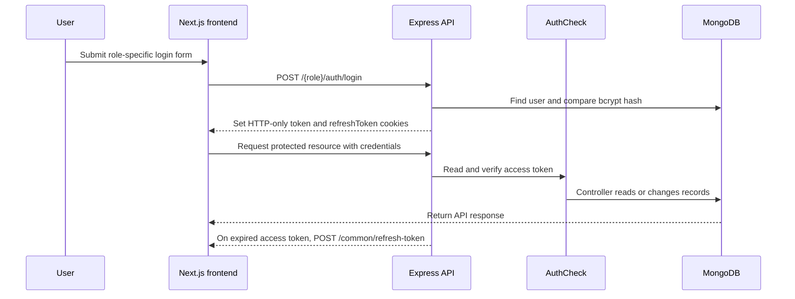

# Role-Based Authentication & Record Management System

A full-stack task and user management application with role-aware authentication, protected REST APIs, and separate admin, manager, and employee experiences.

[](https://nextjs.org/) [](https://nodejs.org/) [](https://expressjs.com/) [](https://www.mongodb.com/)

---

## Overview

This project demonstrates a role-based access control system built around task records. The Next.js frontend communicates with an Express REST API through Axios. The backend authenticates users with JWTs stored in HTTP-only cookies, refreshes short-lived access tokens, and applies role permissions before task operations are executed.

The application supports three roles:

- **Admin:** manages users and has full task access.
- **Manager:** views users and manages task records within the manager permission set.
- **Employee:** views tasks and can update the status of tasks assigned to them.

## Key Features

- Separate login experiences for admins, managers, and employees
- JWT access tokens and seven-day refresh tokens
- HTTP-only `token` and `refreshToken` cookies
- Role checks through authentication middleware and task permissions
- Task creation, listing, assignment, editing, status updates, and soft deletion
- Assigned-task view for the authenticated user
- Admin user creation with generated temporary passwords sent by email
- Admin user listing, assignable-user lookup, and active/inactive status toggling
- Profile updates, password changes, logout, and email password-reset links
- Axios credentials support and automatic access-token refresh on `401` responses
- Helmet, CORS restrictions, request logging, and rate limiting configured in the API

## Role-Based Access Control

Permissions below reflect the active `permission.js` map and route middleware. “Read users” refers to the mounted admin user-listing routes, not task records.

| Role | Create tasks | Read tasks | Update tasks | Update task status | Delete tasks | Manage users |
|---|---:|---:|---:|---:|---:|---|
| Admin | ✅ | ✅ | ✅ | ✅ | ✅ | Create, list, assignable lookup, toggle status |
| Manager | ✅ | ✅ | ✅ | ✅ | ❌ | List and assignable lookup |
| Employee | ❌ | ✅ | ❌ | ✅* | ❌ | None |

\* Employees can update status only when the task is assigned to their user ID. All task operations also require a valid authenticated token.

## Authentication & Authorization Architecture



`AuthCheck` accepts the JWT from the `token` cookie or a bearer `Authorization` header. It verifies `JWT_SECRET`, attaches the decoded user to `req.user`, and can restrict access to specific roles. `Authorize` then checks the permission map for task operations.

## Record Management

The managed record type is a **task**. Tasks include a title, description, status, priority, assignee, due date, creator, updater, and deletion flag.

| Operation | Implementation |
|---|---|
| **Create** | `POST /tasks/create`; available to admin and manager roles through `create_task` |
| **Read** | `GET /tasks/list`, `GET /tasks/assigned`, and `GET /tasks/:id`; available to all roles through `read_task` |
| **Update** | `PUT /tasks/:id`; available to admin and manager roles through `update_task` |
| **Status update** | `PATCH /tasks/:id/status`; available to all roles through `update_task_status`, with employee assignment enforcement |
| **Delete** | `DELETE /tasks/:id`; implemented as a soft delete by setting `isDeleted` to `true`; available to admins |

Task statuses are `Pending`, `In Progress`, `Completed`, and `Cancelled`. Priorities are `Low`, `Medium`, `High`, and `Critical`.

## Email, Temporary Credentials & Password Reset

Email is actively used for two workflows:

- When an admin creates a user, the backend generates a temporary password, hashes it with bcrypt, stores the user, and emails the temporary credentials.
- Password-reset links are emailed through `POST /common/reset-password-link`. The reset token is signed with a user-specific secret and expires after 10 minutes.

An OTP model and frontend endpoint constant exist, but the OTP route and verification controller are commented out. OTP verification is therefore **not an active feature** of the current application.

## Technology Stack

### Frontend

- Next.js 16 with the App Router
- React 19 and TypeScript
- Axios with `withCredentials: true`
- React Hook Form with Yup/Joi resolver packages present
- Tailwind CSS 4
- React Toastify, React Icons, Lucide React, and React Select

### Backend

- Node.js with Express 5
- MongoDB with Mongoose
- JSON Web Tokens via `jsonwebtoken`
- Password hashing via `bcryptjs`
- Nodemailer for account and reset-password emails
- Joi validation middleware, with basic request checks and Mongoose validation used by current controllers/models
- Helmet, CORS, `express-rate-limit`, Morgan, cookie-parser, and express-session

## Project Architecture

```text
role-based-access/
├── backend/
│   ├── app.js
│   ├── app/
│   │   ├── config/          # MongoDB and email transport configuration
│   │   ├── controller/      # Auth, user, and task request handlers
│   │   ├── middleware/      # JWT authentication, permissions, validation
│   │   ├── models/          # User, task, and OTP schemas
│   │   ├── routes/          # Common, role, and task route modules
│   │   └── utils/           # Password generation, email, and rate-limit helpers
│   ├── public/              # Static assets and templates
│   └── package.json
└── frontend/
    ├── app/                 # Next.js routes and role-based dashboard pages
    ├── api/                 # Axios instance, endpoints, and service modules
    ├── components/          # Auth, dashboard, profile, task, and user UI
    ├── context/             # Dashboard context
    ├── hooks/               # Authentication hooks
    ├── types/               # Shared frontend data types
    └── package.json
```

## API Overview

The backend listens on port `4000` by default. Unless marked public, endpoints require the authenticated `token` cookie or a bearer token.

### Authentication and Common Routes

| Method | Endpoint | Authentication | Role / permission | Purpose |
|---|---|---|---|---|
| `POST` | `/admin/auth/login` | Public | None | Admin login |
| `POST` | `/manager/auth/login` | Public | None | Manager login |
| `POST` | `/employee/auth/login` | Public | None | Employee login |
| `GET` | `/common/auth/user` | Required | Admin, manager, employee | Get the current user |
| `POST` | `/common/refresh-token` | Refresh cookie | None | Issue a new access token |
| `POST` | `/common/logout` | Required | Admin, manager, employee | Clear auth cookies and invalidate refresh token |
| `PATCH` | `/common/change-password` | Required | Admin, manager, employee | Change the current password |
| `PUT` | `/common/update-details` | Required | Admin, manager, employee | Update the current profile |
| `POST` | `/common/reset-password-link` | Public | None | Send a password-reset email |
| `POST` | `/common/reset-password/:userId/:token` | Reset token | None | Set a new password |

### User Management Routes

| Method | Endpoint | Authentication | Role / permission | Purpose |
|---|---|---|---|---|
| `POST` | `/admin/add-user` | Required | Admin | Create a manager or employee and email temporary credentials |
| `GET` | `/admin/users` | Required | Admin or manager | List manager and employee users |
| `GET` | `/admin/assignable-users` | Required | Admin or manager | List active users eligible for task assignment |
| `PATCH` | `/admin/user/toggleUserStatus/:id` | Required | Admin | Toggle a user between active and inactive |

### Task Routes

| Method | Endpoint | Authentication | Role / permission | Purpose |
|---|---|---|---|---|
| `POST` | `/tasks/create` | Required | `create_task` | Create a task |
| `GET` | `/tasks/list` | Required | `read_task` | List non-deleted tasks |
| `GET` | `/tasks/assigned` | Required | `read_task` | List non-deleted tasks assigned to the current user |
| `GET` | `/tasks/:id` | Required | `read_task` | Get one non-deleted task |
| `PUT` | `/tasks/:id` | Required | `update_task` | Update task details |
| `PATCH` | `/tasks/:id/status` | Required | `update_task_status` | Update task status |
| `DELETE` | `/tasks/:id` | Required | `delete_task` | Soft-delete a task |

## Authentication Flow



The frontend Axios interceptor retries a failed request once after refreshing the access token. Refresh tokens are stored with the user record and invalidated during logout.

## Installation

### Prerequisites

- Node.js and npm
- A running MongoDB instance or MongoDB connection string
- SMTP credentials for account-creation and password-reset emails

Install dependencies in each application directory:

```bash
cd backend
npm install

cd ../frontend
npm install
```

## Environment Variables

Create `backend/.env` with values appropriate for your environment. Secret values are intentionally omitted here.

```env
PORT=4000
MONGODB_URL=your_mongodb_connection_string
JWT_SECRET=your_access_token_secret
REFRESH_SECRET=your_refresh_token_secret
SESSION_SECRECT=your_session_secret
FRONTEND_URL=http://localhost:3000
NODE_ENV=development
EMAIL_HOST=your_smtp_host
EMAIL_PORT=587
EMAIL_USER=your_smtp_username
EMAIL_PASS=your_smtp_password
EMAIL_FROM=sender@example.com
```

The backend reads `MONGODB_URL`, `JWT_SECRET`, `REFRESH_SECRET`, `SESSION_SECRECT`, `FRONTEND_URL`, `NODE_ENV`, and the `EMAIL_*` variables shown above. The spelling `SESSION_SECRECT` matches the current backend code.

For the frontend, create `frontend/.env.local` when the API is not running at its default URL:

```env
NEXT_PUBLIC_BASE_URL=http://localhost:4000
```

Do not commit environment files or real credentials.

## Running the Applications

Start the backend:

```bash
cd backend
npm run dev
```

The API is available at `http://localhost:4000` by default. For a normal Node.js start, use `npm start`.

Start the frontend in a second terminal:

```bash
cd frontend
npm run dev
```

Open `http://localhost:3000` in a browser. Production frontend commands are `npm run build` followed by `npm start`.

## Example API Requests

Admin login, using the HTTP-only cookies returned by the response:

```bash
curl -i -c cookies.txt \\
  -H "Content-Type: application/json" \\
  -d '{"email":"admin@example.com","password":"your_password"}' \\
  http://localhost:4000/admin/auth/login
```

Create a task with the saved cookies:

```bash
curl -i -b cookies.txt \\
  -H "Content-Type: application/json" \\
  -d '{
    "title":"Prepare quarterly report",
    "description":"Collect and review the latest department figures.",
    "assigned_to":"USER_ID",
    "status":"Pending",
    "priority":"High",
    "due_date":"2026-12-31"
  }' \\
  http://localhost:4000/tasks/create
```

Replace the example email, password, and `USER_ID` with values from your local database. Never place real credentials in documentation or source control.

## Security Considerations

Implemented protections include:

- bcrypt password hashing for stored passwords
- JWT access and refresh tokens
- HTTP-only authentication cookies with production-aware `secure` and `sameSite` settings
- Role and permission checks before protected operations
- Employee assignment enforcement for employee status updates
- Environment variables for database, JWT, session, and SMTP secrets
- Helmet security headers, CORS origin checks, request rate limiting, and Morgan request logging
- Basic controller validation and Mongoose schema constraints

The reusable Joi `validate` middleware is present but is not currently attached to the active route definitions. Review and strengthen validation, authorization scoping, and production cookie/CORS settings before deploying publicly.

## Screenshots

Screenshots are not included in the repository yet.

- `docs/screenshots/admin-dashboard.png` — placeholder
- `docs/screenshots/manager-dashboard.png` — placeholder
- `docs/screenshots/employee-dashboard.png` — placeholder

## Future Improvements

- Add automated unit, integration, and end-to-end tests
- Wire Joi schemas into the active routes for consistent request validation
- Implement or remove the currently inactive OTP verification flow
- Add pagination, filtering, and search to task and user listings
- Add audit history for task and user changes
- Add a production deployment configuration and health-check endpoint
- Reconcile stale frontend endpoint constants with the routes currently mounted by the backend

## Learning Outcomes

This project demonstrates practical experience with:

- Full-stack Next.js and Express application structure
- JWT authentication with access-token refresh handling
- HTTP-only cookie authentication and credentialed CORS
- Role-based authorization and permission maps
- RESTful CRUD design for task records
- MongoDB schema modeling with Mongoose references and soft deletion
- Password hashing, email workflows, and environment-based configuration
- Reusable frontend API service modules and form handling

## Contributing

1. Create a feature branch.
2. Keep changes scoped and update the documentation when behavior changes.
3. Run the relevant frontend lint/build checks and backend verification before opening a pull request.
4. Submit a pull request describing the behavior change and validation performed.

## License

No repository-level license file is currently included. The backend package metadata declares the `ISC` license; confirm the intended project-wide license before distributing the repository.
