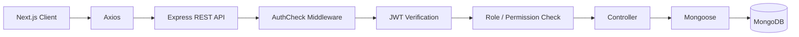
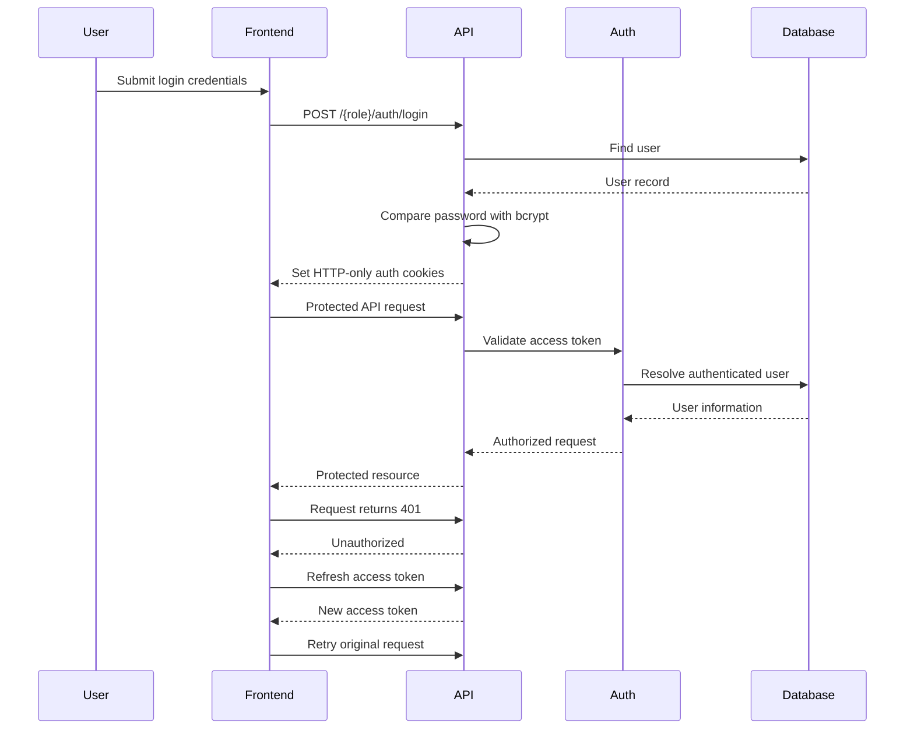

<div align="center">

# 🔐 Role-Based Authentication & Record Management System

### Secure • Scalable • Role-Aware Task Management

A full-stack web application with **JWT authentication, role-based authorization, protected REST APIs, task management, user administration, and automated token refresh**.

<br/>

[](https://nextjs.org/)
[](https://react.dev/)
[](https://www.typescriptlang.org/)
[](https://nodejs.org/)
[](https://expressjs.com/)
[](https://www.mongodb.com/)
[](https://jwt.io/)

<br/><br/>

[✨ Features](#-core-features) •
[🔐 Authentication](#-authentication--authorization) •
[👥 Roles](#-role-based-access-control) •
[📋 Tasks](#-task-management) •
[🚀 Installation](#-getting-started) •
[📡 API](#-api-reference)

<br/><br/>


</div>

---

## 🚀 Why This Project?

This project demonstrates how a modern full-stack application can combine **authentication, authorization, permissions, and business logic** into a secure and maintainable architecture.

Instead of relying only on frontend restrictions, permissions are enforced directly at the **Express API and middleware layer**, ensuring protected operations remain secure even when accessed outside the frontend.

### 👤 Three Dedicated Experiences

|   🔴 Administrator  |       🟣 Manager       |       🔵 Employee      |
| :-----------------: | :--------------------: | :--------------------: |
| Full system control | Task & user management | Assigned task workflow |
| User administration |  Create & update tasks |       View tasks       |
|    Full task CRUD   |   Manage assignments   | Update assigned status |
|  Permission control |    No task deletion    | Restricted permissions |

---

## ✨ Core Features

<div align="center">

|  🔐 Authentication |   🛡️ Authorization   | 📋 Task Management |
| :----------------: | :-------------------: | :----------------: |
| JWT authentication |   Role-based access   |    Create tasks    |
|  HTTP-only cookies | Permission middleware |    Assign tasks    |
|   Refresh tokens   |     Protected APIs    |    Update tasks    |
|  Password hashing  |   Role restrictions   |    Track status    |

| 👥 User Management |   📧 Email Workflows  |  ⚡ API Security |
| :----------------: | :-------------------: | :-------------: |
|    Create users    | Temporary credentials |      Helmet     |
|    Manage users    |     Password reset    |       CORS      |
|    Toggle status   |    SMTP integration   |  Rate limiting  |
|  Assignable users  |  Email notifications  | Request logging |

</div>

---

<div align="center">

### 🧠 Built to Demonstrate Real-World Backend Security

**Authentication → Authorization → Permissions → Business Logic → Database**

<br/>

⭐ **If you find this project useful, consider giving the repository a star!**

</div>

## ✨ Overview

The **Role-Based Authentication & Record Management System** is a full-stack web application designed to demonstrate how modern applications can securely manage users, permissions, and business records.

The platform separates functionality according to user roles while enforcing authorization at the **API and middleware level**, ensuring that frontend restrictions are backed by server-side security controls.

### Core Capabilities

* 🔐 Secure JWT-based authentication
* 👥 Role-based access control
* 🍪 HTTP-only authentication cookies
* 🔄 Automatic access-token refresh
* 📋 Task creation and management
* 👤 User management and assignment
* 📧 Email-based account provisioning
* 🔑 Password change and password recovery
* 🛡️ Protected REST APIs
* 🗑️ Soft deletion of tasks
* ⚡ Responsive Next.js dashboard interfaces
* 🚦 API rate limiting and security middleware

---

## 🎯 Project Goals

This project focuses on implementing the core architecture required by a real-world role-based application:

1. **Authentication** — securely identify users.
2. **Authorization** — control what authenticated users can access.
3. **Permission Management** — apply granular permissions to business operations.
4. **Secure API Design** — protect backend resources independently of the frontend.
5. **Task Management** — provide a practical resource for demonstrating CRUD operations.
6. **Account Management** — support profile, password, and user-administration workflows.

---

## 👥 Role-Based Access Control

The application currently supports three roles.

| Capability            | Admin | Manager | Employee |
| --------------------- | :---: | :-----: | :------: |
| Login                 |   ✅   |    ✅    |     ✅    |
| Create Tasks          |   ✅   |    ✅    |     ❌    |
| View Tasks            |   ✅   |    ✅    |     ✅    |
| Update Tasks          |   ✅   |    ✅    |     ❌    |
| Update Task Status    |   ✅   |    ✅    |    ✅*    |
| Delete Tasks          |   ✅   |    ❌    |     ❌    |
| List Users            |   ✅   |    ✅    |     ❌    |
| View Assignable Users |   ✅   |    ✅    |     ❌    |
| Create Users          |   ✅   |    ❌    |     ❌    |
| Toggle User Status    |   ✅   |    ❌    |     ❌    |
| Update Own Profile    |   ✅   |    ✅    |     ✅    |
| Change Password       |   ✅   |    ✅    |     ✅    |
| Logout                |   ✅   |    ✅    |     ✅    |

> **Employee restriction:** Employees can update the status of a task only when that task is assigned to their own user ID.

Authorization is enforced by the backend using authentication and permission middleware rather than relying solely on frontend UI restrictions.

---

## 🔐 Authentication & Authorization

Authentication uses **JWT access and refresh tokens**.

### Authentication Architecture



### Authentication Flow



### Token Strategy

* **Access token:** short-lived authentication credential.
* **Refresh token:** seven-day token used to obtain a new access token.
* Tokens are stored using **HTTP-only cookies**.
* Refresh tokens are persisted against the authenticated user.
* Logout invalidates the refresh-token state and clears authentication cookies.
* Axios automatically retries a failed request after a successful token refresh.

The backend authentication middleware can read the JWT from the authentication cookie or a bearer `Authorization` header.

---

## 📋 Task Management

Tasks are the primary business resource managed by the application.

Each task can contain:

* Title
* Description
* Status
* Priority
* Assigned user
* Due date
* Creator
* Last updater
* Soft-deletion state

### Task Lifecycle

**Pending → In Progress → Completed**

Tasks can also be moved to **Cancelled** where applicable.

### Supported Statuses

| Status        | Description                                    |
| ------------- | ---------------------------------------------- |
| `Pending`     | Task has been created but work has not started |
| `In Progress` | Task is currently being worked on              |
| `Completed`   | Task has been completed                        |
| `Cancelled`   | Task has been cancelled                        |

### Priority Levels

`Low` · `Medium` · `High` · `Critical`

---

## 🧩 API Architecture

The backend follows a modular Express architecture:

```text
Request
   │
   ▼
Route
   │
   ├── Authentication Middleware
   │
   ├── Authorization Middleware
   │
   ├── Validation
   │
   ▼
Controller
   │
   ▼
Mongoose Model
   │
   ▼
MongoDB
```

This separation keeps authentication, authorization, business logic, and database operations independent and maintainable.

---

## 🌐 API Reference

The backend runs on port `4000` by default.

### Authentication & Common

| Method  | Endpoint                                | Access        | Purpose                |
| ------- | --------------------------------------- | ------------- | ---------------------- |
| `POST`  | `/admin/auth/login`                     | Public        | Admin login            |
| `POST`  | `/manager/auth/login`                   | Public        | Manager login          |
| `POST`  | `/employee/auth/login`                  | Public        | Employee login         |
| `GET`   | `/common/auth/user`                     | Authenticated | Get current user       |
| `POST`  | `/common/refresh-token`                 | Refresh token | Refresh access token   |
| `POST`  | `/common/logout`                        | Authenticated | Logout                 |
| `PATCH` | `/common/change-password`               | Authenticated | Change password        |
| `PUT`   | `/common/update-details`                | Authenticated | Update profile         |
| `POST`  | `/common/reset-password-link`           | Public        | Request password reset |
| `POST`  | `/common/reset-password/:userId/:token` | Reset token   | Reset password         |

### User Management

| Method  | Endpoint                           | Access          | Purpose                            |
| ------- | ---------------------------------- | --------------- | ---------------------------------- |
| `POST`  | `/admin/add-user`                  | Admin           | Create manager/employee            |
| `GET`   | `/admin/users`                     | Admin / Manager | List users                         |
| `GET`   | `/admin/assignable-users`          | Admin / Manager | Get users available for assignment |
| `PATCH` | `/admin/user/toggleUserStatus/:id` | Admin           | Toggle user status                 |

### Task Management

| Method   | Endpoint            | Permission           | Purpose             |
| -------- | ------------------- | -------------------- | ------------------- |
| `POST`   | `/tasks/create`     | `create_task`        | Create task         |
| `GET`    | `/tasks/list`       | `read_task`          | List tasks          |
| `GET`    | `/tasks/assigned`   | `read_task`          | List assigned tasks |
| `GET`    | `/tasks/:id`        | `read_task`          | Get task            |
| `PUT`    | `/tasks/:id`        | `update_task`        | Update task         |
| `PATCH`  | `/tasks/:id/status` | `update_task_status` | Update task status  |
| `DELETE` | `/tasks/:id`        | `delete_task`        | Soft-delete task    |

---

## 📧 Email & Account Management

The application includes email-based account workflows.

### Temporary Credentials

When an administrator creates a new user:

1. User information is submitted.
2. The backend generates a temporary password.
3. The password is securely hashed using bcrypt.
4. The user account is stored.
5. Temporary credentials are sent through email.

### Password Recovery

Users can request a password-reset link through the API.

The reset token:

* Is signed using a user-specific secret.
* Expires after **10 minutes**.
* Allows the user to set a new password.

> **OTP status:** OTP-related models/constants exist in the codebase, but the OTP route and verification controller are currently inactive/commented out. OTP verification should therefore not be considered an active application feature.

---

## 🛡️ Security

Security is implemented across both the authentication and API layers.

### Implemented Controls

* `bcryptjs` password hashing
* JWT access and refresh tokens
* HTTP-only authentication cookies
* Production-aware cookie configuration
* Role-based authorization
* Granular permission middleware
* Employee task-assignment enforcement
* Environment-based secrets
* Helmet security headers
* CORS restrictions
* Express rate limiting
* Morgan request logging
* Mongoose schema validation
* Soft deletion for tasks

### Security Considerations

The reusable Joi validation middleware exists in the project but is not currently attached to all active routes.

Before production deployment, validation coverage, authorization scoping, cookie configuration, CORS policy, logging, and error handling should be reviewed and hardened.

---

## 🏗️ Project Structure

```text
role-based-access/
│
├── backend/
│   ├── app.js
│   ├── app/
│   │   ├── config/
│   │   │   └── Database & email configuration
│   │   ├── controller/
│   │   │   └── Request/business logic
│   │   ├── middleware/
│   │   │   └── Authentication, authorization & validation
│   │   ├── models/
│   │   │   └── Mongoose schemas
│   │   ├── routes/
│   │   │   └── API route definitions
│   │   └── utils/
│   │       └── Shared backend utilities
│   │
│   └── package.json
│
├── frontend/
│   ├── app/
│   │   └── Next.js routes and dashboards
│   ├── api/
│   │   ├── axios/
│   │   ├── endpoints/
│   │   └── services/
│   ├── components/
│   │   └── Reusable UI components
│   ├── context/
│   ├── hooks/
│   ├── types/
│   └── package.json
│
└── README.md
```

---

## ⚙️ Technology Stack

### Frontend

* **Next.js 16** — React framework and application routing
* **React 19** — UI development
* **TypeScript** — Static typing
* **Tailwind CSS 4** — Styling
* **Axios** — API communication
* **React Hook Form** — Form management
* **Yup / Joi resolver packages** — Form validation support
* **React Icons / Lucide React** — Interface icons
* **React Select** — Enhanced select controls
* **React Toastify** — User notifications

### Backend

* **Node.js** — Runtime
* **Express 5** — REST API framework
* **MongoDB** — Database
* **Mongoose** — ODM
* **JSON Web Token** — Authentication
* **bcryptjs** — Password hashing
* **Nodemailer** — Email delivery
* **Helmet** — Security headers
* **express-rate-limit** — Rate limiting
* **Morgan** — HTTP request logging
* **cookie-parser** — Cookie handling
* **express-session** — Session support

---

## 🚀 Getting Started

### Prerequisites

Make sure the following are installed:

* Node.js
* npm
* MongoDB or a MongoDB Atlas connection
* SMTP credentials for email functionality

### 1. Clone the Repository

```bash
git clone <repository-url>
cd role-based-access
```

### 2. Install Backend Dependencies

```bash
cd backend
npm install
```

### 3. Install Frontend Dependencies

```bash
cd ../frontend
npm install
```

---

## 🔑 Environment Configuration

Create `backend/.env`:

```env
PORT=4000
MONGODB_URL=your_mongodb_connection_string
JWT_SECRET=your_access_token_secret
REFRESH_SECRET=your_refresh_token_secret
SESSION_SECRECT=your_session_secret

FRONTEND_URL=http://localhost:3000
NODE_ENV=development

EMAIL_HOST=your_smtp_host
EMAIL_PORT=587
EMAIL_USER=your_smtp_username
EMAIL_PASS=your_smtp_password
EMAIL_FROM=sender@example.com
```

The backend currently reads the environment variables listed above. The spelling `SESSION_SECRECT` intentionally matches the existing backend implementation.

If required, create `frontend/.env.local`:

```env
NEXT_PUBLIC_BASE_URL=http://localhost:4000
```

> Never commit `.env`, `.env.local`, API keys, database credentials, SMTP passwords, or JWT secrets to source control.

---

## ▶️ Running the Application

### Start the Backend

```bash
cd backend
npm run dev
```

Default API:

```text
http://localhost:4000
```

For a standard Node.js start:

```bash
npm start
```

### Start the Frontend

Open another terminal:

```bash
cd frontend
npm run dev
```

Application:

```text
http://localhost:3000
```

### Production Build

Frontend:

```bash
npm run build
npm start
```

---

## 🧪 Example API Request

### Login

The authentication cookies returned by the login response can be persisted with `curl`:

```bash
curl -i -c cookies.txt \
  -H "Content-Type: application/json" \
  -d '{"email":"admin@example.com","password":"your_password"}' \
  http://localhost:4000/admin/auth/login
```

### Create a Task

```bash
curl -i -b cookies.txt \
  -H "Content-Type: application/json" \
  -d '{
    "title":"Prepare quarterly report",
    "description":"Collect and review the latest department figures.",
    "assigned_to":"USER_ID",
    "status":"Pending",
    "priority":"High",
    "due_date":"2026-12-31"
  }' \
  http://localhost:4000/tasks/create
```

Replace the example values with data from your local environment.

---

## 🖥️ Application Screenshots

Screenshots can be added under:

```text
docs/
└── screenshots/
    ├── admin-dashboard.png
    ├── manager-dashboard.png
    └── employee-dashboard.png
```

Recommended screenshots:

* Admin dashboard
* Manager dashboard
* Employee dashboard
* Task creation interface
* Task management interface
* User management interface
* Login interface

---

## 🔮 Future Improvements

Potential improvements include:

* Automated unit and integration testing
* End-to-end testing
* Complete Joi validation coverage
* Pagination and server-side filtering
* Advanced task search
* Task audit history
* User activity logs
* Improved notification system
* Health-check endpoint
* Production deployment configuration
* Complete OTP verification workflow
* API documentation with OpenAPI/Swagger
* Improved synchronization between frontend endpoint constants and backend routes

---

## 📚 Learning Outcomes

This project demonstrates practical implementation of:

* Full-stack application architecture
* Next.js App Router
* REST API development with Express
* JWT authentication
* Refresh-token architecture
* HTTP-only cookie authentication
* Role-based access control
* Permission-based authorization
* CRUD operations
* MongoDB and Mongoose relationships
* Password hashing
* Email-based workflows
* Secure API configuration
* Axios interceptors
* Form management
* Middleware-driven backend architecture
* Soft deletion
* Environment-based configuration

---

## 🤝 Contributing

Contributions and improvements are welcome.

1. Create a feature branch.
2. Keep changes focused and maintainable.
3. Update documentation when application behavior changes.
4. Run frontend and backend checks before submitting changes.
5. Open a pull request describing the changes and validation performed.

---

## 📄 License

No repository-level `LICENSE` file is currently included.

The backend package metadata specifies the **ISC** license. Before distributing the complete project, confirm and add the intended project-wide license.

---

## 👨‍💻 Project

**Role-Based Authentication & Record Management System**

A full-stack project focused on demonstrating secure authentication, authorization, permission management, and practical task-management workflows.